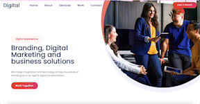

# Marketing Agency Website

This is a website for a marketing agency that provides services such as website design, social media marketing, and SEO to showcase their business.

## Demo

 https://annniewann.github.io/marketing-agency-website/

## Features

The following features are currently available on the website:

- Information about the marketing agency and its services
- A portfolio of previous projects
- Testimonials from satisfied clients
- A contact form for potential clients to get in touch

## Technologies

The website was built using the following technologies:

- HTML
- CSS
- JavaScript
- [Bootstrap](https://getbootstrap.com/)
- [Animate.css](https://animate.style/)

## Installation

To run the website locally, follow these steps:

1. Clone the repository: `git clone https://github.com/AnnnieWann/marketing-agency-website.git`
2. Navigate to the project directory: `cd marketing-agency-website`
3. Open `index.html` in your web browser.

